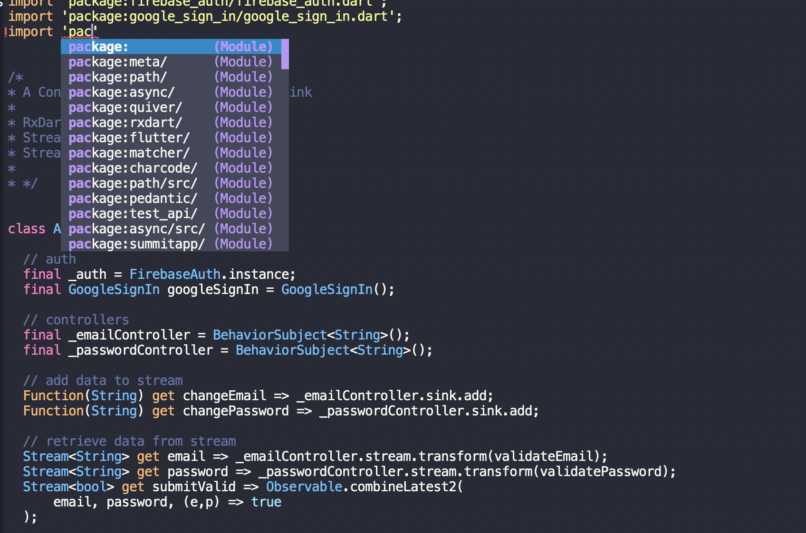
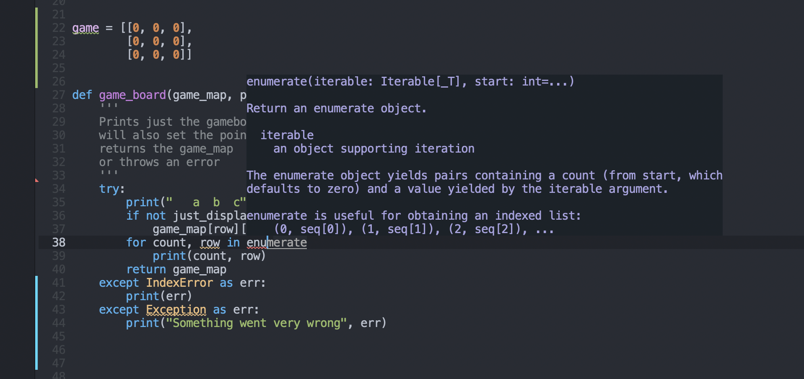

# Doom Emacs
# Dart 

# Python 
My Doom Emacs config for programming in Dart & Flutter, Python and Javascript

includes:
- dart language & flutter linting, syntax highlighting & suggestions with documentation
 - run ```M-x lsp``` to start the dart language server
- support for flychecking .js with eslint, ensure to include a config.js
- rxjs mode and react-snippets for es6 / react development 
- doom themes
- python server with autocomplete ```Mx jedi-mode```

have a look at doom - https://github.com/hlissner/doom-emacs
